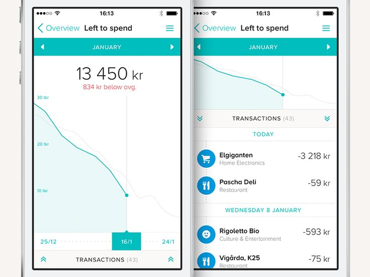

# Fio Stats
Přehled příjmů a výdajů z Fio banky

Aplikace umožňuje spravovat kategorie přijmů a výdajů a automaticky
rozpoznává další podobné transakce a zatřídí je.

Aplikace využívá veřejné API Fio Banky, kde si každý uživatel může
z internetového bankovnictví vygenerovat token pro přístup k datům.

## Funkce
- Aplikace všechna data získává přímo z API Fio Banky,
  data jsou uložena pouze v zařízení
- Graf vývoje částky na účtu
- Zobrazení útraty podle kategorie
    - jídlo
    - bydlení
    - energie = elektřina / plyn
    - oblečení
    - zábava
    - software
    - hry
- Poprvé se ručně přiřadí kategorie k transakci a aplikace
  tuto kategorii přiřadí ke všem podobným transakcím příště automaticky
- Přehled výdajů za jednotlivé měsíce podle kategorií
- Notifikace změně stavu účtu

## Obsah aplikace
- Z levé strany vysuvné menu
    - Přehled
        - 1/3 výšky displaye graf se zůstatkem účtu
        - Přepínání kategorií, výchozí jsou všechny
        - Seznam transakcí
    - Kategorie
        - Seznam kategorií s tlačítkem na přejmenování a smazání
        - Vpravo dole tlačíko pro přidání nové kategorie
    - Nastavení
        - Textové pole pro nastavení tokenu pro přístup k Fio Banka API
